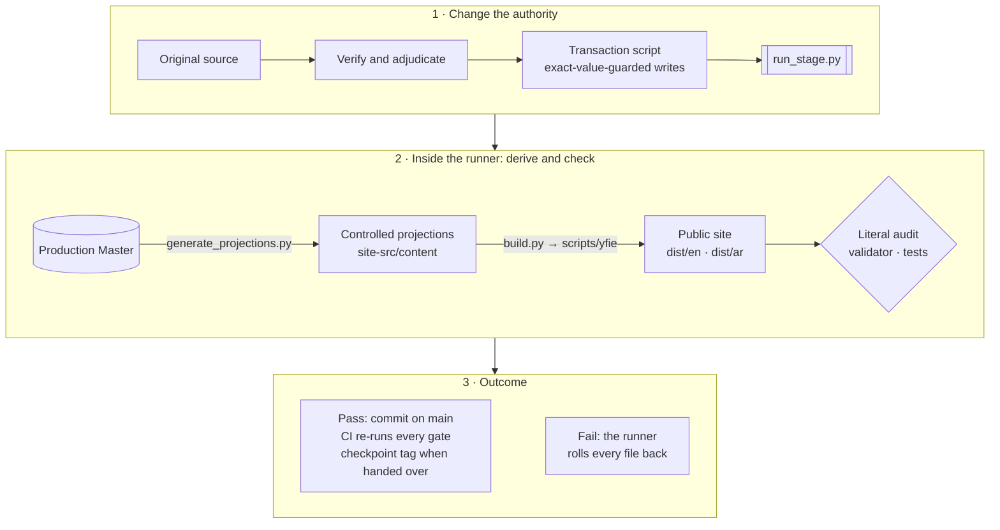
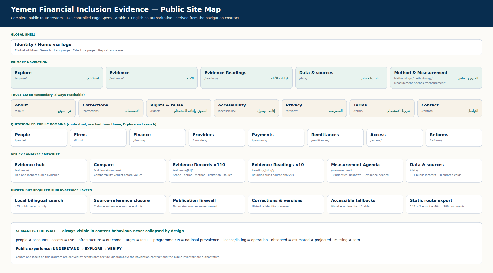

# Yemen Financial Inclusion Evidence · أدلة الشمول المالي في اليمن

[](https://github.com/CausewayGrp/Financial-inclusion-/actions/workflows/verify.yml)

A public evidence resource, built and maintained by CauseWay, that takes a reader from a question to the strongest
answer the evidence supports — then shows the scope of that answer, what it does not establish, what remains unknown,
and the record, method and original source behind it. It clarifies evidence for human decisions; it makes no
regulatory, political, business or funding decision for anyone.

The product's distinguishing claim is that **financial inclusion in Yemen is not one number**. Its evidence was
measured at different times, by different methods, for different populations and institutions. The product keeps those
differences visible instead of resolving them into a score.

This is the **single production repository** and the only working copy. Its `main` branch is the current state. The
Production Master is the sole semantic, evidence, source, rights, controlled-product-state and publication-state
authority; everything else here is derived from it, implements it, or records how it came to be.

## Status at a glance

| | |
|---|---|
| **Position** | **DESIGN HANDOFF READY** — R8.6 closed and the F0–F9 integration programme accepted clean-room ([record](audit/FINAL_CLEAN_ROOM_ACCEPTANCE.md)); the post-F9 correction and the design-enablement control pass of 27 September 2026 applied |
| **Not declared** | Not PUBLIC RELEASE READY |
| **Now** | **The release candidate.** Pull request #9 (branch `code/release-candidate-fixes`) implements the owner's decisions of 2 October 2026 ([`audit/OWNER_DECISIONS_2026-10-02.md`](audit/OWNER_DECISIONS_2026-10-02.md)) and the after-merge conditions of pull request #8: three Master transactions (RC-1 truth fixes, RC-2 trust copy, RC-3 governed interface strings), the question sets in the presentation contract (EAD-11), the logo's web-size derivatives (EAD-03; cold pages from about 10.3 MB to under 0.7 MB), each figure's boundary printed once (A3), the retired frame removed from `/reforms/` (A5), the search status with its true total and a result-type filter (A6), and these records reconciled ([`audit/RECORDS_RECONCILIATION_2026-10-02.md`](audit/RECORDS_RECONCILIATION_2026-10-02.md)); Part B of the same pull request finishes, challenges and hardens the product. The brief: [`audit/release_candidate/INSTRUCTIONS.md`](audit/release_candidate/INSTRUCTIONS.md). The Design programme is complete (D0–D7, pull request #7; the owner's D7 acceptance of 2 October 2026) and the production runtime is merged (pull request #8) — see [Design programme](#design-programme--current-state) |
| **Next** | Independent review of pull request #9. Once it lands, the open items that remain are release-time only ([`FINAL_OPEN_ITEMS_REGISTER.md`](FINAL_OPEN_ITEMS_REGISTER.md) §2): hosting and the public origin, live security headers, the currentness re-run at the release date, and the owner's release acceptance; the post-launch items carry their dispositions in the register |
| **Owner actions** | Push the two checkpoint tags and delete five merged branches ([below](#checkpoints-and-tags)); decide the OWNER_INPUT and RELEASE_ONLY items in [`FINAL_OPEN_ITEMS_REGISTER.md`](FINAL_OPEN_ITEMS_REGISTER.md) |
| **Production Master** | `authority/Yemen_Financial_Inclusion_Evidence_Master.xlsx` · SHA-256 `ebfb929c86bb54c690b96059b71ae6ff40a5af4cc27c50d80ed7fa4bcea653cb` |
| **Page Specs** | `site-src/content/page_specs.json` · SHA-256 `add00f4a0c210b6889da98f6ff00498340687491db43ff005f5039559dd04646` |
| **Logo authority** | `site-src/assets/CauseWay_Master_Logo.png` · SHA-256 `5830163d…` (full value: `logo_sha256` in [`FINAL_REPOSITORY_MANIFEST.json`](FINAL_REPOSITORY_MANIFEST.json)); never redrawn, recoloured, cropped or regenerated |
| **Last state OpenAI reviewed** | Commit `f726bda`, tree byte-identical to `…TRANCHE_C_COMPLETE_READING_HOLD.zip` (SHA-256 `63612dea…`); accepted 26 September 2026 |
| **Currentness cut-off** | 3 October 2026 for the watch points re-read in the release-candidate sweep ([`audit/release_candidate/ORIGINAL_SOURCE_VERIFICATION.md`](audit/release_candidate/ORIGINAL_SOURCE_VERIFICATION.md) §3–4); 26 September 2026 for the rest ([`audit/FINAL_CURRENTNESS_CUTOFF.md`](audit/FINAL_CURRENTNESS_CUTOFF.md)) |
| **Re-entry document** | [`OPENAI_REENTRY_CHECKPOINT.md`](OPENAI_REENTRY_CHECKPOINT.md) |

The same state is recorded in [`authority/YFI_CURRENT_PROJECT_CONTEXT.json`](authority/YFI_CURRENT_PROJECT_CONTEXT.json),
the checkpoint and [`handoff/IMPLEMENTATION_MANIFEST.json`](handoff/IMPLEMENTATION_MANIFEST.json); the validator fails if
their hashes or their handoff state diverge.

## Start here — by role

| You are | Start with | Then |
|---|---|---|
| **Claude Design** | [`handoff/README_FIRST.md`](handoff/README_FIRST.md) — the one start file and reading order | [`handoff/CLAUDE_DESIGN_MASTER_PROMPT.md`](handoff/CLAUDE_DESIGN_MASTER_PROMPT.md), the one executable brief; then your own records in [`design/`](design/) |
| **Claude Code** | [`handoff/CLAUDE_CODE_MASTER_PROMPT.md`](handoff/CLAUDE_CODE_MASTER_PROMPT.md) — the Code brief, started on the accepted Design package (owner's acceptance recorded 2 October 2026); the production runtime is merged (pull request #8) and the release candidate is pull request #9 | [`handoff/ENGINEERING_HANDOFF_EXPECTATIONS.md`](handoff/ENGINEERING_HANDOFF_EXPECTATIONS.md), [`design/09_CODE_HANDOFF.md`](design/09_CODE_HANDOFF.md), [`docs/DEPLOYMENT.md`](docs/DEPLOYMENT.md) |
| **An independent reviewer** | [`OPENAI_REENTRY_CHECKPOINT.md`](OPENAI_REENTRY_CHECKPOINT.md) | [`audit/FINAL_CLEAN_ROOM_ACCEPTANCE.md`](audit/FINAL_CLEAN_ROOM_ACCEPTANCE.md), [`audit/INDEX.md`](audit/INDEX.md) |
| **The programme steward** | [`AGENTS.md`](AGENTS.md), then [`CONTRIBUTING.md`](CONTRIBUTING.md) | [`authority/CORE_CONSTITUTION.md`](authority/CORE_CONSTITUTION.md); §4 of the protocol for any Master change |
| **The owner (CauseWay)** | [Owner actions](#owner-actions) below | [`FINAL_OPEN_ITEMS_REGISTER.md`](FINAL_OPEN_ITEMS_REGISTER.md) §5 (owner inputs) and §2 (release-only) |

## Quick start

```bash
git clone https://github.com/CausewayGrp/Financial-inclusion-.git && cd Financial-inclusion-
python3 -m pip install -r requirements.txt           # Python 3.11
python3 -m playwright install chromium                # only for the two browser suites

python3 scripts/checksums.py --check                  # every file matches SHA256SUMS.txt
python3 scripts/validate.py                           # WEBSITE REPOSITORY VALIDATION PASS
python3 -m http.server 4173 --directory dist          # the production site, the accepted design: /en/ and /ar/
```

`design/reference/build.py` renders the same site through the same renderer, plus the design-review artefacts the six
design checks read (content bundles, export frames, social frames):
`python3 design/reference/build.py && python3 -m http.server 4174 --directory design/reference/out`.

All gates, with what each protects, are in [`CONTRIBUTING.md` §5](CONTRIBUTING.md#5-the-gates); CI runs them on every
push to `main` and every pull request. They also pass from an extracted archive with no `.git`.

## Design programme — current state

Claude Design owns the visual and interaction solution and delivers a runnable reference site; the steward lands and
verifies each gate; Claude Code implements the production runtime afterwards. This section is the Design programme's
own present-state record and is rewritten at every gate.

| Field | Value |
|---|---|
| **Date** | 28 September 2026 |
| **Last accepted gate** | **D7 — the whole programme accepted.** Pull request #7 landed on `main` at `fca7bf1` (28 September 2026; an ordinary commit, the branch's last, not a merge commit), Verify green; the owner's final visual acceptance is recorded on 2 October 2026 in [`audit/OWNER_DECISIONS_2026-10-02.md`](audit/OWNER_DECISIONS_2026-10-02.md) (row D7). Earlier: D6 at `0ccdf01` (#5, #6), D2–D5 at `2effd8b` (#4), D1 at `851f496` (#3), D0 at `8bf19ef` (#1, #2) |
| **Working gate** | **None — the Design programme is closed.** What follows is engineering, not design: the eleven EAD items of [`FINAL_OPEN_ITEMS_REGISTER.md`](FINAL_OPEN_ITEMS_REGISTER.md) §1, carried by pull request #8, in the states the register holds: **EAD-01, EAD-04, EAD-05 and EAD-09 closed 2026-09-29** (`dist/` is rendered by the accepted design through `scripts/yfie`, `scripts/build.py` is its driver, the replaced renderer is removed, and parity with the pre-design build is proved against a frozen oracle, `scripts/tests/test_cutover_parity.py`); EAD-08 self-hosted, all but its optional subsetting; EAD-02, EAD-06 and EAD-10 at the point where the rest is not Code's; EAD-03 blocked on the owner's approval; EAD-07 blocked on controlled content; EAD-11 narrowed, open with the steward |
| **What stands (D1–D7)** | One chosen direction (T4 · Instrument) with its tokens, evidence grammar and shell. All 36 governed visual contracts stand in their tier's form on every route that binds them — thirteen drawn, twenty-two governed text frames, the RETIRE contract asserted absent — each with its detached frame, named-column table and isolated dates. Every one of the 288 documents is bound and asserted on its own ledger row; the thirteen journeys are walked by keyboard at 390 and 1440 px in Arabic and English; every tool state and technical state is driven and rendered; the print system, the export frames (unshipped until OWN-04) and five social-image templates exist |
| **What remains** | The gate closed at 73 of 73 acceptance lines, with 1,415 of 1,433 coverage rows `VERIFIED` and the remaining 18 settled with the reason each cannot be proved without inventing a record. **No design debt blocks the gate.** Three debts stay open by decision, none of them design work: **DEBT-016** (the logo's file weight) closed on 2 October 2026 in the release-candidate pull request (EAD-03: pure resamples of the unchanged master on every surface); **DEBT-008** (Home's paced "three figures" paragraph) does not block release — the fallback is the unpaced governed paragraph, with no governed text altered ([`audit/PR8_INDEPENDENT_ACCEPTANCE.md`](audit/PR8_INDEPENDENT_ACCEPTANCE.md) A8) — and waits on the steward (a controlled pacing marker, Master-first) and Design, not on the owner; **DEBT-011** (`/data/` page length) blocks nothing — a shortening was attempted, measured a 44 % cut, and was reverted when the gate suite caught that it put a governed citation path behind a disclosure |
| **Build and check** | `python3 design/reference/build.py`, then `check_content.py`, `check_binding.py`, `check_site.py --gate d2/d3/d4`, `check_journeys.py`, `check_trio.py`, `check_visuals.py`, `tokens.py --check` — all in `design/reference/`, all building through `scripts/yfie`; then the two browser suites and the invariance check with `YFIE_SITE_DIR=design/reference/out` |
| **Records** | [`design/00_DESIGN_README.md`](design/00_DESIGN_README.md) (status and the decision log), [`design/10_ACCEPTANCE_CHECKLIST.md`](design/10_ACCEPTANCE_CHECKLIST.md), [`design/COVERAGE.csv`](design/COVERAGE.csv), [`design/DESIGN_DEBT.md`](design/DESIGN_DEBT.md), [`design/ESCALATIONS.md`](design/ESCALATIONS.md), [`design/09_CODE_HANDOFF.md`](design/09_CODE_HANDOFF.md), and `design/01`–`08` for the system itself |

## How truth flows



A content defect is never fixed in a page, a JSON file or code alone. It is fixed in the Master through a transaction
that the runner commits or rolls back as a whole:
**SOURCE → VERIFY → ADJUDICATE → MASTER FIRST → REGENERATE → SEMANTIC PARITY → PUBLIC ACCEPTANCE.**
The procedure is [`CONTRIBUTING.md` §4](CONTRIBUTING.md#4-changing-the-master). Two files under `site-src/content/` are
not generated: the presentation-depth and navigation contracts, which the steward maintains in place and the generator
validates ([`CONTRIBUTING.md` §2](CONTRIBUTING.md#2-who-owns-what-and-how-it-changes)).

## The public product



- **Experience:** UNDERSTAND → EXPLORE → VERIFY. A consequential claim travels as ANSWER → SCOPE → BOUNDARY → VERIFY.
- **Question first:** Home offers four common governed questions; Explore holds all of them in four clusters; eight
  domain answer routes (`/people/ /firms/ /finance/ /providers/ /payments/ /remittances/ /access/ /reforms/`) carry the
  answers, each with its scope, boundary, unknowns, next measurement and verification path.
- **Primary navigation:** Explore · Evidence · Evidence Readings · Data & sources · Method & Measurement (Methodology,
  Measurement Agenda). **Trust:** About · Corrections · Rights & reuse · Accessibility · Privacy · Terms · Contact.
  Derived from [`navigation_interaction.json`](site-src/content/content/navigation_interaction.json).
- **Verification:** every Evidence Record is a canonical page with its definition, population, period, currentness,
  boundary, method and original sources; Compare tests whether records can be compared before showing values.
- **Semantic firewall, visible in every surface:** people ≠ accounts · access ≠ use · infrastructure ≠ outcome · target ≠
  result · programme KPI ≠ national prevalence · licence/listing ≠ operation · observed ≠ estimated ≠ projected ·
  missing ≠ zero · chronology ≠ causality.
- **Not:** a generic Yemen financial-system observatory, a provider ranking, an unofficial strategy or a CauseWay
  marketing site. CauseWay organises, synthesises and maintains; source institutions remain authoritative for their data.

### Product properties

| Property | Value |
|---|---|
| Editions | Arabic and English, co-authoritative — neither is a translation of the other; a gate fails on any numeric difference between a page pair |
| Delivery | Static, local-first, strict-CSP compatible; no backend, analytics, cookies or accounts |
| Typefaces | IBM Plex Sans and IBM Plex Sans Arabic, self-hosted unchanged from [`vendor/fonts/`](vendor/fonts/README.md) (OFL-1.1) |
| Routes | Every route exists at `/en/…` and `/ar/…`; `/` opens the reader's chosen edition; there is a 404 in both |
| Accessibility | Designed against WCAG 2.2 AA outcomes; conformance is not claimed before the implemented site is audited |
| Downloads and exports | Designed, and shipped disabled, until the owner decides the content licence (OWN-04); third-party documents are never redistributed |

### Scale

Counts come from [`public_inventory.json`](site-src/content/content/public_inventory.json), which is derived from the
Master; the validator checks every figure below against it. Counts are an inventory, not a measure of evidence strength.

- 143 controlled Page Specs; 286 localized route documents + root + 404 = 288 static HTML documents.
- 110 Evidence Records, of which 60 are controlled public claims; 55 Evidence Passports (reference material, never
  rendered).
- 10 Readings; 10 Measurement priorities; 11 governed entry questions.
- 36 governed visual contracts, each with a design tier in `site-src/content/visuals/visual_design_contracts.json`.
- 165 source records, of which 156 expose a public original locator; 28 curated resource cards.
- 23 documented chronology events (the analytical rule YSC-020 is not counted).
- 440 public search records.

## Decisions that shape everything here

| Decision | Why | Recorded in |
|---|---|---|
| One Production Master; everything else derived or subordinate | One place where truth changes, with a cell-level ledger and a rollback | [`authority/CORE_CONSTITUTION.md`](authority/CORE_CONSTITUTION.md) |
| Information architecture: Explore · Evidence · Evidence Readings · Data & sources · Method & Measurement, with a secondary trust layer; no route changes | Task-first labels a general reader understands, without breaking deep links | [`audit/CLAUDE_S01_IA_DECISION.md`](audit/CLAUDE_S01_IA_DECISION.md) |
| Question-led entry: a few starting questions on Home, all of them on Explore | One mental model for entry; no competing task taxonomy | [`audit/R8_4A_HOME_EXPLORE_ENTRY_JOURNEY_CLOSURE.md`](audit/R8_4A_HOME_EXPLORE_ENTRY_JOURNEY_CLOSURE.md) |
| Evidence Records are separate from original sources; a source without a public locator is never named | Readers verify against the original; nothing unverifiable is presented as citable | [`audit/R8_1_PUBLIC_TRUTH_SOURCE_REFERENCE_CLOSURE.md`](audit/R8_1_PUBLIC_TRUTH_SOURCE_REFERENCE_CLOSURE.md) |
| No composite score, dashboard or synchronised "current state" | The evidence shares no clock, unit, denominator or population | Design brief §4.4 |
| Arabic and English are co-authoritative; every page pair prints the same numbers | Neither edition is a translation of the other; a gate enforces numeric parity | [`audit/F5_PUBLIC_CORPUS_ACCEPTANCE.md`](audit/F5_PUBLIC_CORPUS_ACCEPTANCE.md) |
| Static, local-first, strict-CSP compatible; no analytics, cookies or accounts | Works without a backend; nothing to leak or track | [`docs/DEPLOYMENT.md`](docs/DEPLOYMENT.md) |
| Two controlled contracts maintained by the steward, validated by the generator | Presentation depth and navigation are product decisions, not facts | [`CONTRIBUTING.md` §2](CONTRIBUTING.md#2-who-owns-what-and-how-it-changes) |
| Design completes only with a runnable, fully populated reference site in both editions, after competing theses are tested | Code must never guess; a picture is not a specification | Design brief §19–§20 |
| Design works in a loop and remembers through the repository: kernel, decision log, coverage ledger, design-debt register, escalations, Code handoff — re-read at every gate start, committed at every gate end | A cold agent, or Code later, continues without any conversation | Design brief §0, §19 |
| IBM Plex Sans and Sans Arabic, vendored unchanged; the canonical logo never altered | Identity and licence integrity | [`vendor/fonts/README.md`](vendor/fonts/README.md), Design brief §8 |

## The Design gates D0–D7

Eight gates, one pull request each, each leaving a runnable state. Gate names D0–D7 belong to the **Design** programme;
the similarly numbered D0–D9 files in [`audit/directives/`](audit/directives/README.md) are the **programme
directives** that governed the earlier work — the two sequences are unrelated.

| Gate | Scope | State |
|---|---|---|
| **D0** | Orientation: authority, dependency map, the records opened, the plan and the theses named. No screens | Accepted — `8bf19ef` (#1, #2) |
| **D1** | Two or three materially different theses proved on Home, `/evidence/CLM-003/` and `/readings/same-year-different-number/` in both editions; one chosen with recorded reasons; then tokens, grammar, shell and type | Accepted — `851f496` (#3); direction T4 · Instrument |
| **D2** | The hardest page families and figures | Accepted — `2effd8b` (#4) |
| **D3** | Synthesis and reference pages; the Home cold-reader test | Accepted — `2effd8b` (#4) |
| **D4** | Every route bound through family rules; all 288 documents render | Accepted — `2effd8b` (#4) |
| **D5** | Every tool, journey, technical state, keyboard path and accessibility outcome | Accepted — `2effd8b` (#4) |
| **D6** | Visuals per contract, detached frames, social templates, the print system | Accepted — `0ccdf01` (#5, #6) |
| **D7** | Acceptance against [`handoff/DESIGN_ACCEPTANCE_CRITERIA.md`](handoff/DESIGN_ACCEPTANCE_CRITERIA.md): the four review tests, the last-ten-percent audit, every label governed, the records complete | Accepted — `fca7bf1` (#7, 28 September 2026); the owner's final visual acceptance recorded 2 October 2026 ([`audit/OWNER_DECISIONS_2026-10-02.md`](audit/OWNER_DECISIONS_2026-10-02.md)) |

Every gate has an entry condition, durable outputs, exit evidence and stop conditions (brief §20), and closes with the
Code recipient test: could Claude Code continue from this commit without the Design conversation?

Design never edits the Master, the projections, the contracts or the public build in `dist/`: it escalates
(`ESCALATE_TO_MASTER`, `NEEDS_CONTROLLED_CONTENT`) and the steward answers Master-first.

## Programme tracker

| Stage | Scope | State | Record |
|---|---|---|---|
| R0–R8.3 | Reconciliation, public voice, Readings and Measurement, method and trust, journeys, resources, information design, numeric parity across editions, source-reference closure, literature recovery, intellectual product | CLOSED / PASS | [`audit/R0_…`](audit/R0_CANONICAL_RECONCILIATION_CLOSURE.md) … [`audit/R8_3_…`](audit/R8_3_INTELLECTUAL_PRODUCT_CLOSURE.md) |
| R8.4A | Home, Explore and governed question-led entry | CLOSED / PASS | [`audit/R8_4A_…`](audit/R8_4A_HOME_EXPLORE_ENTRY_JOURNEY_CLOSURE.md) |
| Tranche A | Authority and active surface; IA decision (Option B, no route changes); currentness; resource model; domain architectures | CLOSED | [`audit/CLAUDE_TRANCHE_A_HANDBACK.md`](audit/CLAUDE_TRANCHE_A_HANDBACK.md) |
| Tranche B | Master-first patch specification, then execution in five transactional stages | CLOSED | [`audit/TRANCHE_B_EXECUTION_CLOSURE.md`](audit/TRANCHE_B_EXECUTION_CLOSURE.md) |
| P1–P5 | Pre-Tranche-C maturation (truth, tools, visual readiness, handoff alignment) and corrections | CLOSED; independently accepted | [`audit/P5_…`](audit/P5_INDEPENDENT_ACCEPTANCE_CORRECTIONS.md) |
| **R8.4 · Tranche C** | Whole-product adversarial acceptance: nine-lens panel, 229 findings dispositioned, 9 BLOCKERs closed, transactions TC-S1, TC-A … TC-I | **COMPLETE**; accepted by OpenAI (26 Sep 2026); Reading prose completed in F2 | [`audit/TRANCHE_C_FINAL_ACCEPTANCE.md`](audit/TRANCHE_C_FINAL_ACCEPTANCE.md) |
| F1–F2 | Evidence Readings portfolio adjudicated and integrated Master-first (RP-F2); numeric parity 0 differences | CLOSED | [`audit/READING_PORTFOLIO_FINAL_ADJUDICATION.md`](audit/READING_PORTFOLIO_FINAL_ADJUDICATION.md) |
| F3 | Five bounded Resource Library decisions | CLOSED | [`audit/F3_RESOURCE_DECISIONS.md`](audit/F3_RESOURCE_DECISIONS.md) |
| F4 · R8.5 | Repository subtraction: copy out of code, one path from authority to recipient, file manifest, audit index, permanent gates | CLOSED | [`audit/R8_5_REPOSITORY_SUBTRACTION_CLOSURE.md`](audit/R8_5_REPOSITORY_SUBTRACTION_CLOSURE.md) |
| F5 | Whole public corpus acceptance: every public text reviewed in Arabic, in English, and for parity; 667 findings decided | CLOSED | [`audit/F5_PUBLIC_CORPUS_ACCEPTANCE.md`](audit/F5_PUBLIC_CORPUS_ACCEPTANCE.md) |
| F6 | Discovery (canonical, hreflang, robots, sitemap, structured data), accessibility contract, rights, security and privacy gates | CLOSED | [`audit/F6_…`](audit/F6_DISCOVERY_ACCESSIBILITY_RIGHTS_SECURITY_ACCEPTANCE.md) |
| F7 | Sustainability baseline of the reference build (bytes, requests, cold and warm) and a non-public stewardship note | CLOSED | [`docs/SUSTAINABILITY_METHOD.md`](docs/SUSTAINABILITY_METHOD.md) |
| F8 · R8.6 | Handoff freeze: one start file, one Design prompt, one logo authority, route/content/state inventory, acceptance criteria, Design→Code contract, open-items register | CLOSED | [`audit/R8_6_…`](audit/R8_6_DESIGN_HANDOFF_FREEZE_CLOSURE.md) |
| **F9 · R8.6** | Clean-room acceptance by three cold recipients; archive test from an empty directory; final register; fonts vendored | **CLOSED — DESIGN HANDOFF READY** | [`audit/FINAL_CLEAN_ROOM_ACCEPTANCE.md`](audit/FINAL_CLEAN_ROOM_ACCEPTANCE.md) |
| Post-F9 correction | OWN-07 and OWN-08 closed; the two controlled contracts classified; the handoff tightened in place | CLOSED (27 Sep 2026) | Addendum in [`audit/FINAL_CLEAN_ROOM_ACCEPTANCE.md`](audit/FINAL_CLEAN_ROOM_ACCEPTANCE.md); directive [`D8`](audit/directives/D8_POST_F9_CORRECTION_2026-09-27.txt) |
| Design-enablement control pass | The handoff checked against the quality doctrine for a cold recipient and strengthened in place: kernel, working loop, memory rule, review tests, debt register, gate entry/exit/stop | CLOSED (27 Sep 2026) | Second addendum, same record; directive [`D9`](audit/directives/D9_DESIGN_ENABLEMENT_CONTROL_PASS_2026-09-27.txt) |
| **Design D0–D6** | Orientation, competing theses, the chosen direction, every family, every document, every tool and state, the visual and print systems | **ACCEPTED AND MERGED** (27–28 Sep 2026) | [`design/00_DESIGN_README.md`](design/00_DESIGN_README.md); pull requests #1–#6 |
| **Design D7** | Closure: every recorded blocker settled, judged on the rendered product by three independent lenses | **ACCEPTED** (28 Sep 2026, `fca7bf1`, the last commit of pull request #7, landed on `main`; final visual acceptance recorded by the owner 2 Oct 2026, [`audit/OWNER_DECISIONS_2026-10-02.md`](audit/OWNER_DECISIONS_2026-10-02.md)) | Pull request #7; [`design/10_ACCEPTANCE_CHECKLIST.md`](design/10_ACCEPTANCE_CHECKLIST.md); lens reports in `design/evidence/d7/cold_read/` |

## Open items

Every item, classed and owned, is in [`FINAL_OPEN_ITEMS_REGISTER.md`](FINAL_OPEN_ITEMS_REGISTER.md): 47 items,
**zero DESIGN_BLOCKER**. Design's own temporary compromises are separate and live in
[`design/DESIGN_DEBT.md`](design/DESIGN_DEBT.md).

| Class | Count | What they are |
|---|---|---|
| Engineering after Design | 11 | The production runtime; the WCAG 2.2 audit of the implemented site; web-size logo derivatives (owner-approved, master file unchanged); no CSS recolouring of the logo; the Method & Measurement navigation group; Compare entry from a record and mobile Compare; a source-type filter on the governed field; self-hosted IBM Plex; social images; re-measured page weight; Home and Explore question sets out of code |
| Release only | 4 | Security headers at the host; source reuse rights; optional native Arabic certification; named release acceptance |
| External evidence dependencies | 11 | Sources not yet read in the original — among them IMF Country Report 26/80 (four chronology facts), the date of Decision No. 10 of 2026, the entity names in Decision No. 18 of 2026, the OECD 2026 figures and the SFD/SMED primary. The public text stays unchanged until each is read |
| Known evidence frontiers | 8 | Stated on the pages and never filled: the withheld CLM-044 value; the ~147-firm base behind the 91.84% table; the CBY-Aden ↔ IMF remittance crosswalk; the causes of the gender gap; reconciled current operating-provider status; the size of the 2022 banking restatement; composite records without listed members; one deferred sub-national series |
| Owner input | 6 | CauseWay identity and funding statement; contact-mailbox confirmation; the public origin; a content licence (gates every CauseWay-content download and export); stewardship decisions; a reversed logo if Design needs one |
| Rejected / no action | 7 | Recorded so nobody reopens them by accident |

## Owner actions

1. **Push the two checkpoint tags, and delete the five merged branches** — both are refused to the working sessions
   (HTTP 403). The exact tag commands are in [`OPENAI_REENTRY_CHECKPOINT.md` §7](OPENAI_REENTRY_CHECKPOINT.md#7-owner-actions);
   the branches are listed under [Checkpoints and tags](#checkpoints-and-tags).
2. **Decide the owner inputs** in the register: the CauseWay identity and funding statement, the contact mailbox, the
   public origin, the content licence, stewardship, and a reversed logo only if Design asks for one.
3. **Before any public release:** the RELEASE_ONLY items, a post-implementation accessibility audit and a named release
   acceptance. Nothing in this repository declares public release readiness.

## Checkpoints and tags

A checkpoint is a governed state handed to a reviewer or to Design: a signed, annotated tag `checkpoint/<state>` on a
green `main` commit; `.github/workflows/checkpoint.yml` then rebuilds the archive, verifies it from an empty extraction
and attaches it to a pre-release ([`CONTRIBUTING.md` §6](CONTRIBUTING.md#6-checkpoints-and-packages)).

| Tag | Commit | State on GitHub |
|---|---|---|
| `checkpoint/tranche-c-complete-reading-hold` | `f726bda` — the tree OpenAI reviewed | Not yet pushed (owner action) |
| `checkpoint/design-handoff-ready` | `6d954c1` — the design-enablement control pass, the state the Design programme started from | Not yet pushed (owner action) |

A checkpoint tag is never moved or rewritten. Until the tags exist, commits and the changelog identify each state.

Five branches are fully merged into `main` and can be deleted: `claude/dreamy-archimedes-e8qx5v`,
`claude/bold-maxwell-r3o015`, `claude/epic-cori-60fpeb`, `claude/practical-cray-sr26c5` and
`design/d0-orientation`. Deleting a branch and pushing a tag are both refused to the working sessions
(HTTP 403), so both are owner actions.

## Where to find everything

| Question | Where |
|---|---|
| What is current? | This file, [`OPENAI_REENTRY_CHECKPOINT.md`](OPENAI_REENTRY_CHECKPOINT.md), [`authority/YFI_CURRENT_PROJECT_CONTEXT.json`](authority/YFI_CURRENT_PROJECT_CONTEXT.json) |
| Where is the Design programme? | [Design programme](#design-programme--current-state) above; the records are in [`design/`](design/) |
| What is still open, and who owns it? | [`FINAL_OPEN_ITEMS_REGISTER.md`](FINAL_OPEN_ITEMS_REGISTER.md); Design's own compromises in [`design/DESIGN_DEBT.md`](design/DESIGN_DEBT.md) |
| Where does Claude Design start? | [`handoff/README_FIRST.md`](handoff/README_FIRST.md) — one file, one reading order |
| What is every file? | [`FINAL_REPOSITORY_MANIFEST.json`](FINAL_REPOSITORY_MANIFEST.json) (class of every tracked file); [`SHA256SUMS.txt`](SHA256SUMS.txt) (its hash) |
| What changed, when and why? | `git log`; [`docs/CHANGELOG.md`](docs/CHANGELOG.md) |
| Which cells of the Master changed? | Per transaction: `audit/<stage>/runs/<TX>_MASTER_LEDGER.json` (cell level) and `<TX>_RUN_REPORT.json` (gates); also the commit trailers |
| Every finding and its disposition | [`audit/F5_CORPUS_FINDINGS_LEDGER.csv`](audit/F5_CORPUS_FINDINGS_LEDGER.csv) (public corpus); [`audit/TRANCHE_C_FINDINGS_LEDGER.csv`](audit/TRANCHE_C_FINDINGS_LEDGER.csv); earlier [`audit/pre_tranche_c/FINDINGS_LEDGER.csv`](audit/pre_tranche_c/FINDINGS_LEDGER.csv); the three cold-recipient reports in `audit/final_integration/inputs/` |
| Which audit record answers what? | [`audit/INDEX.md`](audit/INDEX.md) |
| The binding programme directives | [`audit/directives/`](audit/directives/README.md) — all complete through D9 |
| Is a commit sound? | Actions → **Verify** (`Governance gates`, `Browser acceptance`) |

```bash
git log --oneline --decorate                                      # history
git log --grep='^Master-After:' --date=short \
  --format='%h %ad %(trailers:key=Transaction,valueonly,separator=) %(trailers:key=Master-Before,valueonly,separator=) → %(trailers:key=Master-After,valueonly,separator=)'
git diff --stat f726bda -- authority site-src dist                # governed change since the reviewed state
git tag -l 'checkpoint/*' -n1                                     # checkpoints, once the owner has pushed them
```

## Repository map

| Path | Role | Edited by |
|---|---|---|
| [`authority/`](authority/) | The Production Master, the constitution, the current-state pointers | Transactions and the runner only (constitution: explicit decision) |
| [`site-src/content/`](site-src/content/) | Controlled projections: Page Specs, sections, evidence, sources, visuals, search | Generator only |
| `site-src/content/presentation_priority.json`, `site-src/content/content/navigation_interaction.json` | Controlled contracts: presentation depth; navigation and interaction | The steward, in place, naming the finding; validated by the generator |
| `site-src/app.js`, `site-src/lang-redirect.js`, `site-src/assets/` | The tools runtime, the neutral root entry and the canonical CauseWay logo (never redrawn) | Directly, with the gates |
| [`scripts/yfie/`](scripts/yfie/) | **The one production renderer**: the accepted Design implementation — content path, page families, visual contracts, the stylesheet, the text layer | Directly, with the gates |
| `site-src/assets/social/` | The 286 governed social images (1200 × 630, one per route and language), rasterised from the design's template because that needs a browser; the build copies them into `dist/` | `scripts/social_images.py` only |
| [`scripts/`](scripts/) | Generator, build driver, literal audit, validator, rebind, inventory, checksums, tests | Directly, with the gates |
| `dist/` | The generated public site, committed so every public change is reviewable | `scripts/build.py` only |
| [`design/architecture/`](design/architecture/) | Programme diagrams: three derived from the navigation contract and inventory, the Design-to-Code flow hand-maintained | `scripts/architecture_diagrams.py`; the flow by the steward |
| [`design/`](design/) (everything else) | Claude Design's package: the system `01`–`08`, the records, and `reference/` — the design-review harness and its six checks, which build **through** `scripts/yfie` into the git-ignored `design/reference/out/` and hold no renderer of their own | Claude Design, through pull requests |
| [`vendor/fonts/`](vendor/fonts/README.md) | IBM Plex Sans and IBM Plex Sans Arabic (woff2, OFL), unchanged; the build ships the six faces the stylesheet declares, with the licence | Replaced only by a newer unchanged release |
| [`handoff/`](handoff/) | The Design → Code recipient package; start at [`handoff/README_FIRST.md`](handoff/README_FIRST.md) | The programme only |
| [`audit/`](audit/) | Closures, ledgers, transaction scripts and run reports, directives | Append only; history is not rewritten |
| [`docs/`](docs/) | Changelog, deployment, sustainability method, repository protocol; S00–S06 records are lineage | Directly |
| [`.github/`](.github/) | CI (`verify.yml`), checkpoint packaging (`checkpoint.yml`), Dependabot, PR template | Directly |
| `FINAL_OPEN_ITEMS_REGISTER.md` | Every open item, classed and owned | The steward; closures appended |
| `FINAL_REPOSITORY_MANIFEST.json`, `SHA256SUMS.txt` | Class and hash of every tracked file | `scripts/repository_manifest.py`, `scripts/checksums.py` |

## Working on this repository

- **Protocol:** [`CONTRIBUTING.md`](CONTRIBUTING.md) — ownership, branches, commit trailers, Master transactions, gates,
  checkpoints, session sync, known pitfalls, recommended repository settings.
- **AI agents** (Claude Code, Claude Design, review agents): [`AGENTS.md`](AGENTS.md); `CLAUDE.md` imports it.
- **Durable rules:** [`authority/CORE_CONSTITUTION.md`](authority/CORE_CONSTITUTION.md).
- Every session starts from `origin/main` and ends with a push. Work that exists only in a chat, a ZIP or a Drive folder
  does not exist for the next session.
- Repository documentation is written in English; the public product is Arabic and English, and both editions are
  governed by the Master. No governed word of either edition is authored here.

## Release boundary

Controlled content and green gates are not enough to call the product ready for live release. Release also requires
technical, runtime, security and privacy acceptance; deployed mobile, RTL and accessibility acceptance; publication
filtering; rights and legal checks where applicable; correction and version behaviour; and named release approval.
Not claimed anywhere in this repository: native Arabic certification, legal review, WCAG conformance, rights clearance,
security guarantees or service levels.

## Historical lineage

- The R0–R8 finalization records, the Tranche A/B closures and the S00–S06 documents under `docs/` are kept as lineage
  and are not rewritten. `audit/R8_CONTINUATION_MASTER_HANDOVER_TO_NEXT_WINDOW.md` and `audit/FINALIZATION_PROGRAM.md`
  describe the programme as it stood when they were written.
- Before 26 September 2026 the working repository was a Drive folder, exchanged as ZIP checkpoints. Those copies were
  deliberately left untouched and are lineage, not working copies (`EXTERNAL_REPOSITORY_SYNC_PENDING` records that
  state; no sync is owed). The Master entry state recorded with the Drive IDs was `e6980410…` (full value in
  `authority/AUTHORITY.json`).
