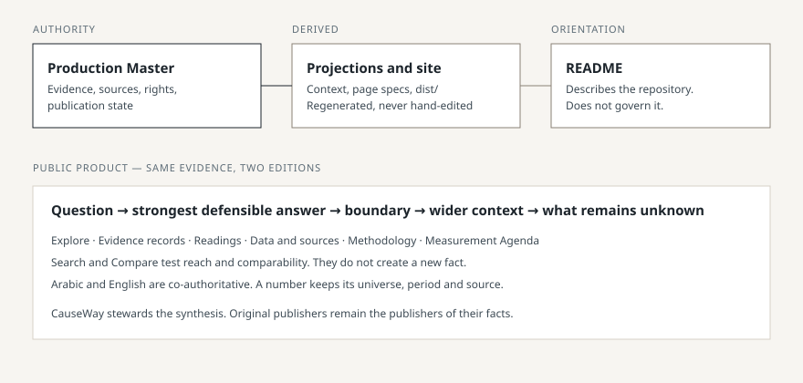
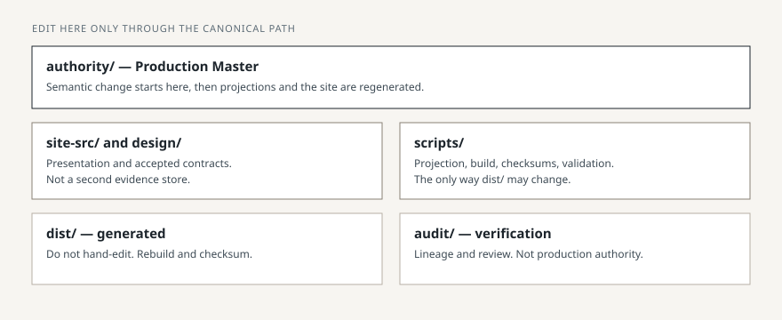
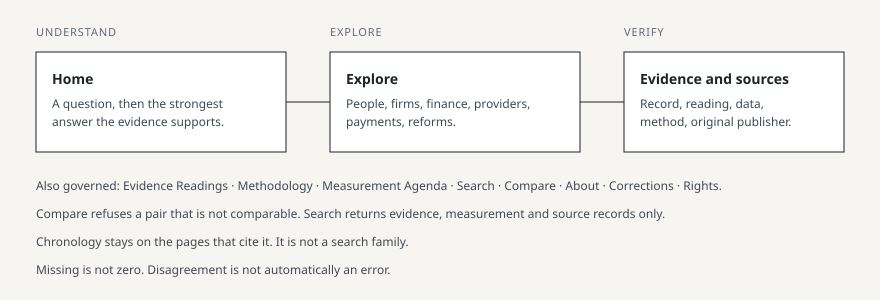

# Yemen Financial Inclusion Evidence · أدلة الشمول المالي في اليمن

[](https://github.com/CausewayGrp/Financial-inclusion-/actions/workflows/verify.yml)

Developed and maintained by CauseWay.

Yemen Financial Inclusion Evidence is a governed bilingual evidence resource. It starts from a consequential question about financial inclusion in Yemen and gives the strongest answer the controlled evidence can support. It then shows what that answer means, what it does not establish, the wider system context that changes its reading, what remains unknown, and what should be measured next. The record, the method and the original source stay attached.

It exists because financial inclusion in Yemen cannot be read from one number, one institution or one moment. The available evidence covers different populations, institutions, units, methods, periods, geographies and publishing authorities. An ordinary dashboard collapses those differences. This resource keeps them visible.

The public path is understand, then explore, then verify. Arabic and English are co-authoritative editions of the same governed evidence. Arabic is not a later translation.

CauseWay stewards the synthesis, the derivation and the corrections process. CauseWay is not the regulator, the official statistical authority, or the publisher of third-party evidence.

## What it is, and what it is not

It is a decision resource for reading financial inclusion evidence. It is not a dashboard, a regulator, an official statistical authority, a general financial-system observatory, a provider directory, a reform tracker, a research blog, or a CauseWay marketing site. Broader financial-system context appears only where it changes the reading of inclusion evidence.

## How the evidence is kept bounded

A number without its universe, period and meaning can be true and still mislead. Every consequential figure stays tied to its population, period, definition, material method, original source, evidence state and limit, and to what it does not establish.

These distinctions are the product, not a footnote:

- People are not accounts.
- Access is not use.
- Infrastructure is not an outcome.
- A target is not a result.
- A programme indicator is not national prevalence.
- A licence or a listing is not operation.
- Missing is not zero.
- The observation date is not the publication date.
- Disagreement is not automatically an error.
- Bounded evidence stays bounded.

Full method: the public Methodology pages, generated from the Master. Rights, citation and corrections: About, Rights & reuse, and Corrections.

External facts stay attributed to their original publishers. CauseWay attribution covers CauseWay synthesis and stewardship only. A public URL is not permission to redistribute. Restricted source files are not republished because they can be found online. Citation, factual use and redistribution are separate permissions.



## Current state

| | |
|---|---|
| **Position** | **DESIGN HANDOFF READY** |
| Non-design v1 product | Complete |
| Current phase | Design / presentation integration |
| Post-v1, owner decision | C1 typed difference block; C2 dedicated guarantee route; C3 public contradiction index |
| Reuse rights | Decided: CC BY 4.0 for CauseWay's own content (adopted 3 October 2026, closed 10 October 2026). The owner confirmed the licence text on 10 October 2026 (RIGHTS-FINAL; no legal review is claimed); the rights question is closed permanently |
| Public release ready | No |
| Open pull request | #11, draft, branch `code/final-content` |

Closed in this product state: governed evidence and content for v1; Used on reaches every source, including those with no domain use recorded; a single valid Compare entry loads the reader's record and still requires two records for a verdict; the 23 dated events of the system chronology are indexed in search, each deep-linking to its own anchor on /finance/ (the analytical rule is not a dated event and is not indexed); the reuse licence for CauseWay's own content (CC BY 4.0, [`audit/OWNER_DECISIONS_2026-10-10.md`](audit/OWNER_DECISIONS_2026-10-10.md)) — a reuse licence is not regulatory licensing, and CauseWay neither holds nor claims the status of a licensed financial institution.

Not closed, and not claimed: design integration; integrated Arabic and English, RTL, mobile, accessibility and browser acceptance after that integration; release-time hosting, security headers, currentness and live checks; final owner release approval. The repository's software code is outside the CC BY 4.0 licence and no code licence is decided.

Remaining path: non-design v1 complete, then design / presentation integration, then final integrated QA, then release / cutover, then owner release approval. Release-time steps live in [`docs/RELEASE_RUNBOOK.md`](docs/RELEASE_RUNBOOK.md). Open items live in [`FINAL_OPEN_ITEMS_REGISTER.md`](FINAL_OPEN_ITEMS_REGISTER.md). The content-pass ledger is [`audit/final_content/FINAL_CONTENT_LOG.md`](audit/final_content/FINAL_CONTENT_LOG.md).

## Authority

This is the single production repository. The Production Master is the sole semantic, evidence, source, rights, controlled-product and publication authority:

`authority/Yemen_Financial_Inclusion_Evidence_Master.xlsx`

Master SHA-256: `58b8f3ec5ac1324dfafc7eb6b4015b88da0cb9c241078903be82fe0f6492421b`

Page Specs SHA-256: `7467bf55a6702790ceebc34118356b1b552ea5559fd32e928c21d5c907a1ccf7`

| Layer | Role |
|---|---|
| Production Master | Authority |
| `authority/YFI_CURRENT_PROJECT_CONTEXT.json` | Projection. It does not overrule the Master |
| `site-src/`, `design/`, `scripts/` | Presentation, contracts, and the machines that project and check |
| `dist/` | Generated public site. Do not hand-edit |
| This README | Orientation. Not authority |
| `audit/` | Verification and lineage. Not a second production authority |

If the Master changes, subordinate projections are regenerated. There is no parallel truth.



## Repository map

| Path | Why a recipient goes there |
|---|---|
| [`authority/`](authority/) | Master, constitution, current-state projection |
| [`site-src/`](site-src/) | Presentation source. Evidence text is projected, not authored here |
| [`scripts/`](scripts/) | Canonical projection, build, checksums and validation |
| [`design/`](design/) | Accepted presentation contracts and tokens |
| [`dist/`](dist/) | Generated site, committed so a public change is reviewable |
| [`audit/`](audit/) | Review and lineage |
| [`docs/RELEASE_RUNBOOK.md`](docs/RELEASE_RUNBOOK.md) | What release still requires |
| [`handoff/`](handoff/) | Design and engineering handoff, subordinate to the Master |

## Public path

Home asks the question. Questions leads to people, firms, banks and microfinance, providers, payments and reforms. Evidence, Readings and Sources carry the record and the publisher. Methodology and Measurement priorities hold method and what should be measured next. Search returns evidence, measurement and source records. Compare tests comparability before it shows values. About, Corrections, and Rights and reuse hold accountability.



Both editions live at `/en/…` and `/ar/…`. `/` opens the reader's chosen edition.

## Safe start

Work on `code/final-content` until pull request #11 is reviewed. Do not treat `main` as the content-pass head.

```bash
python3 scripts/generate_projections.py --check
python3 scripts/social_images.py --check
python3 scripts/build.py
python3 scripts/checksums.py --check
python3 scripts/validate.py
python3 -m http.server 8080 --directory dist
```

`dist/` is produced by `scripts/build.py`. A gate fails if the committed site differs from a fresh build.

Invariants: Master first for any semantic change; never hand-edit generated output; do not add a second source of truth; do not widen a figure beyond its universe, period or geography; keep Arabic and English semantically the same; do not treat a public URL as redistribution permission. Operating rules: [`CONTRIBUTING.md`](CONTRIBUTING.md) and [`authority/CORE_CONSTITUTION.md`](authority/CORE_CONSTITUTION.md).

## Where to go next

Methodology, rights and corrections are public pages generated from the Master. Architecture and deployment: [`docs/DEPLOYMENT.md`](docs/DEPLOYMENT.md). Release history and programme audits stay in `audit/` and `docs/CHANGELOG.md`. They are history, not the current front door.
