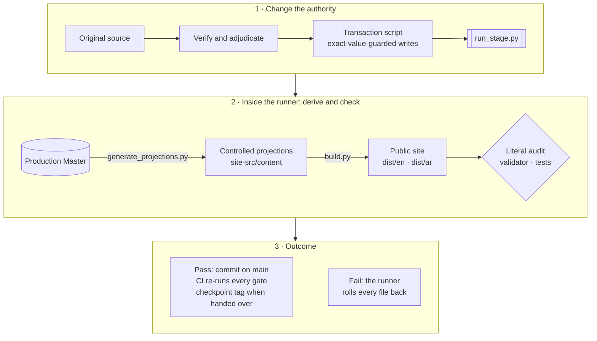

# Yemen Financial Inclusion Evidence · أدلة الشمول المالي في اليمن

[](https://github.com/CausewayGrp/Financial-inclusion-/actions/workflows/verify.yml)

A bilingual public evidence resource, built by CauseWay, that helps people **understand, compare and verify** the
evidence on financial inclusion in Yemen. Arabic and English are co-authoritative editions. It clarifies evidence for
human decisions; it does not make regulatory, political, business or funding decisions for anyone.

This is the **single production repository**. Its `main` branch is the current state; every reviewed or handed-off
state is a signed `checkpoint/*` tag. The Production Master is the sole semantic, evidence, source, rights,
controlled-product-state and publication-state authority; everything else here is derived from it or implements it.

## Status at a glance

| | |
|---|---|
| **Position** | **READING PORTFOLIO INTEGRATED — TRANCHE C ACCEPTANCE PRESERVED** (final integration programme, session F2 of F0–F9) |
| **Not declared** | Not DESIGN HANDOFF READY · not PUBLIC RELEASE READY |
| **Waiting on** | Nothing external. OpenAI accepted Tranche C (recipient verification 31/31) and supplied the ten-Reading package; sessions F3–F9 of directive [D7](audit/directives/D7_FINAL_INTEGRATION_TO_DESIGN_HANDOFF_2026-09-26.md) are in progress |
| **Reviewed checkpoint** | Tag [`checkpoint/tranche-c-complete-reading-hold`](../../tree/checkpoint/tranche-c-complete-reading-hold): tree byte-identical to the review ZIP `…TRANCHE_C_COMPLETE_READING_HOLD.zip` (SHA-256 `63612dea…`) |
| **Since that checkpoint** | Repository infrastructure, then F2: the ten Evidence Readings integrated Master-first in one transaction (RP-F2; [adjudication](audit/READING_PORTFOLIO_FINAL_ADJUDICATION.md), [change ledger](audit/READING_PORTFOLIO_CHANGE_LEDGER.csv)); BIL-05 closed — every English/Arabic page pair prints the same numbers |
| **Production Master** | `authority/Yemen_Financial_Inclusion_Evidence_Master.xlsx` · SHA-256 `440614d789f662e2e47d95e932968be3c71d2719187bb91c6f546aed30e72f71` |
| **Page Specs** | `site-src/content/page_specs.json` · SHA-256 `0425dc85c1662120a2b00a5bb3485b93d4f64f6058d7e2a0ebeb477dedc3e871` |
| **Currentness cut-off** | 26 September 2026 ([`audit/FINAL_CURRENTNESS_CUTOFF.md`](audit/FINAL_CURRENTNESS_CUTOFF.md)) |
| **Re-entry document** | [`OPENAI_REENTRY_CHECKPOINT.md`](OPENAI_REENTRY_CHECKPOINT.md) |

The same state is recorded in [`authority/YFI_CURRENT_PROJECT_CONTEXT.json`](authority/YFI_CURRENT_PROJECT_CONTEXT.json)
and the checkpoint; the validator fails if the hashes in this file, the checkpoint, the Context and the handoff manifest
diverge.

## Quick start

```bash
git clone https://github.com/CausewayGrp/Financial-inclusion-.git && cd Financial-inclusion-
python3 -m pip install -r requirements.txt           # Python 3.11
python3 -m playwright install chromium                # only for the two browser suites

python3 scripts/checksums.py --check                  # every file matches SHA256SUMS.txt
python3 scripts/validate.py                           # WEBSITE REPOSITORY VALIDATION PASS
python3 -m http.server 4173 --directory dist          # preview: http://localhost:4173/en/ and /ar/
```

All gates, with what each protects, are in [`CONTRIBUTING.md` §5](CONTRIBUTING.md#5-the-gates); CI runs them on every
push to `main` and every pull request.

## How truth flows



A content defect is never fixed in a page, a JSON file or code alone. It is fixed in the Master through a transaction
that the runner commits or rolls back as a whole:
**SOURCE → VERIFY → ADJUDICATE → MASTER FIRST → REGENERATE → SEMANTIC PARITY → PUBLIC ACCEPTANCE.**
The procedure is [`CONTRIBUTING.md` §4](CONTRIBUTING.md#4-changing-the-master).

## The public product


- **Experience:** UNDERSTAND → EXPLORE → VERIFY. A consequential claim travels as ANSWER → SCOPE → BOUNDARY → VERIFY.
- **Question first:** Home offers a few common governed questions; Explore holds all of them; eight domain answer routes
  (`/people/ /firms/ /finance/ /providers/ /payments/ /remittances/ /access/ /reforms/`) carry the answers.
- **Primary navigation:** Explore · Evidence · Evidence Readings · Data & sources · Method & Measurement (Methodology,
  Measurement Agenda). **Trust:** About · Corrections · Rights & reuse · Accessibility · Privacy · Terms · Contact. Derived
  from [`navigation_interaction.json`](site-src/content/content/navigation_interaction.json).
- **Semantic firewall, visible in every surface:** people ≠ accounts · access ≠ use · infrastructure ≠ outcome · target ≠
  result · programme KPI ≠ national prevalence · licence/listing ≠ operation · observed ≠ estimated ≠ projected ·
  missing ≠ zero · chronology ≠ causality.
- **Not:** a generic Yemen financial-system observatory, a provider ranking, an unofficial strategy or a CauseWay
  marketing site. CauseWay organises, synthesises and maintains; source institutions remain authoritative for their data.

### Scale

Counts come from [`public_inventory.json`](site-src/content/content/public_inventory.json), which is derived from the
Master; the validator checks every figure below against it. Counts are an inventory, not a measure of evidence strength.

- 143 controlled Page Specs; 286 localized route documents + root + 404 = 288 static HTML documents.
- 110 Evidence Records, of which 60 are controlled public claims; 55 Evidence Passports.
- 10 Readings; 10 Measurement priorities; 11 governed entry questions.
- 36 governed visual contracts, each with a design tier in `site-src/content/visuals/visual_design_contracts.json`.
- 161 source records, of which 152 expose a public original locator; 28 curated resource cards.
- 24 documented chronology events.
- 436 public search records.

## Programme tracker

| Stage | Scope | State | Record |
|---|---|---|---|
| R0–R8.3 | Reconciliation, public voice, Readings and Measurement, method and trust, journeys, resources, information design, bilingual invariance, source-reference closure, literature recovery, intellectual product | CLOSED / PASS | [`audit/R0_…`](audit/R0_CANONICAL_RECONCILIATION_CLOSURE.md) … [`audit/R8_3_…`](audit/R8_3_INTELLECTUAL_PRODUCT_CLOSURE.md) |
| R8.4A | Home, Explore and governed question-led entry | CLOSED / PASS | [`audit/R8_4A_…`](audit/R8_4A_HOME_EXPLORE_ENTRY_JOURNEY_CLOSURE.md) |
| Tranche A | Authority and active surface; IA decision (Option B, no route changes); currentness; resource model; domain architectures | CLOSED | [`audit/CLAUDE_TRANCHE_A_HANDBACK.md`](audit/CLAUDE_TRANCHE_A_HANDBACK.md) |
| Tranche B | Master-first patch specification, then execution in five transactional stages | CLOSED | [`audit/TRANCHE_B_EXECUTION_CLOSURE.md`](audit/TRANCHE_B_EXECUTION_CLOSURE.md) |
| P1–P5 | Pre-Tranche-C maturation (truth, tools, visual readiness, handoff alignment) and corrections | CLOSED; independently accepted | [`audit/P5_…`](audit/P5_INDEPENDENT_ACCEPTANCE_CORRECTIONS.md) |
| **R8.4 · Tranche C** | Whole-product adversarial acceptance: nine-lens panel, 229 findings dispositioned, 9 BLOCKERs closed, transactions TC-S1, TC-A … TC-I | **COMPLETE**; Reading prose held (BIL-05) | [`audit/TRANCHE_C_FINAL_ACCEPTANCE.md`](audit/TRANCHE_C_FINAL_ACCEPTANCE.md) |
| R8.5 | Repository subtraction and recipient cleanup | Not started | [D6 §16–25](audit/directives/D6_FINAL_FINITE_PRODUCT_PROGRAM_TRANCHE_C_R8_5_R8_6.txt) |
| R8.6 | Clean-room Claude Design handoff freeze; its final state is allowed only after the Definition of Done | Not started | [D6 §26–50](audit/directives/D6_FINAL_FINITE_PRODUCT_PROGRAM_TRANCHE_C_R8_5_R8_6.txt) |

**Open items** (full list in [the checkpoint §4](OPENAI_REENTRY_CHECKPOINT.md#4-open-items-carried-forward-not-defects-of-this-checkpoint)):
- **Held for the Reading package (BIL-05):** three Reading-prose parity items; they are the only reason the bilingual
  numeric check reports differing page pairs.
- **R8.5:** duplicate runtime references, duplicate `(1)` audit files, public copy still in `build.py`/`app.js`
  (AR-29, EN-09, TRUST-25), the file-role manifest, the audit index and the remaining permanent gates.
- **Release-only:** web-size logo derivatives (TOOL-02), navigation-group presentation (TOOL-25, Design-owned), CauseWay
  identity and funding statement (TRUST-09, owner input).
- **Evidence frontiers kept explicit, never filled:** the withheld residual-model value (CLM-044), the ~147-firm base
  behind the 91.84% table, the CBY-Aden ↔ IMF remittance crosswalk, the causes of the gender gap, reconciled current
  operating-provider status, the size of the 2022 banking restatement.

## Where to find everything

| Question | Where |
|---|---|
| What is current? | This file, [`OPENAI_REENTRY_CHECKPOINT.md`](OPENAI_REENTRY_CHECKPOINT.md), [`authority/YFI_CURRENT_PROJECT_CONTEXT.json`](authority/YFI_CURRENT_PROJECT_CONTEXT.json) |
| What changed, when and why? | `git log`; [`docs/CHANGELOG.md`](docs/CHANGELOG.md) |
| Which cells of the Master changed? | Per transaction: `audit/<stage>/runs/<TX>_MASTER_LEDGER.json` (cell level) and `<TX>_RUN_REPORT.json` (gates); from now on also the commit trailers |
| Every finding and its disposition | [`audit/TRANCHE_C_FINDINGS_LEDGER.csv`](audit/TRANCHE_C_FINDINGS_LEDGER.csv); earlier [`audit/pre_tranche_c/FINDINGS_LEDGER.csv`](audit/pre_tranche_c/FINDINGS_LEDGER.csv) |
| Every state handed to a reviewer or to Design | Tags `checkpoint/*` and their pre-releases with the verified ZIP |
| The binding programme | [`audit/directives/`](audit/directives/README.md) — D6 is current |
| Is a commit sound? | Actions → **Verify** (`Governance gates`, `Browser acceptance`) |

```bash
git tag -l 'checkpoint/*' -n1                                     # every checkpoint and its one-line state
git log --oneline --decorate                                      # history
git log --grep='^Master-After:' --date=short \
  --format='%h %ad %(trailers:key=Transaction,valueonly,separator=) %(trailers:key=Master-Before,valueonly,separator=) → %(trailers:key=Master-After,valueonly,separator=)'
git diff --stat checkpoint/tranche-c-complete-reading-hold -- authority site-src dist    # governed change since the review
```

## Repository map

| Path | Role | Edited by |
|---|---|---|
| [`authority/`](authority/) | The Production Master, the constitution, the current-state pointers | Transactions and the runner only (constitution: explicit decision) |
| [`site-src/content/`](site-src/content/) | Controlled projections: Page Specs, sections, evidence, sources, visuals, search | Generator only |
| `site-src/app.js`, `site-src/styles.css`, `site-src/assets/` | Static runtime baseline and the canonical CauseWay logo (never redrawn) | Directly, with the gates |
| [`scripts/`](scripts/) | Generator, build, literal audit, validator, rebind, checksums, tests | Directly, with the gates |
| `dist/` | The generated public site, committed so every public change is reviewable | `scripts/build.py` only |
| [`design/architecture/`](design/architecture/) | Diagrams derived from the navigation contract and inventory | `scripts/architecture_diagrams.py` |
| [`handoff/`](handoff/) | Design → Code recipient package, DRAFT until R8.6 — do not execute | The programme only |
| [`audit/`](audit/) | Closures, ledgers, transaction scripts and run reports, directives | Append only; history is not rewritten |
| [`docs/`](docs/) | Changelog, deployment, repository protocol; S00–S06 records are lineage | Directly |
| [`.github/`](.github/) | CI (`verify.yml`), checkpoint packaging (`checkpoint.yml`), Dependabot, PR template | Directly |
| `SHA256SUMS.txt` | Checksum manifest of every tracked file | `scripts/checksums.py` |

## Working on this repository

- **Protocol:** [`CONTRIBUTING.md`](CONTRIBUTING.md) — branches, commit trailers, Master transactions, gates, checkpoints,
  session sync, known pitfalls, recommended repository settings.
- **AI agents** (Claude Code, Claude Design, review agents): [`AGENTS.md`](AGENTS.md); `CLAUDE.md` imports it.
- **Durable rules:** [`authority/CORE_CONSTITUTION.md`](authority/CORE_CONSTITUTION.md).
- Every session starts from `origin/main` and ends with a push. Work that exists only in a chat, a ZIP or a Drive folder
  does not exist for the next session.

## Release boundary

Controlled content and green gates are not enough to call the product ready for live release. Release also requires
technical, runtime, security and privacy acceptance; deployed mobile, RTL and accessibility acceptance; publication
filtering; rights and legal checks where applicable; correction and version behaviour; and named release approval.
Not claimed anywhere in this repository: native Arabic certification, legal review, WCAG conformance, rights clearance,
security guarantees or service levels.

## Historical lineage

- The R0–R8 finalization records, the Tranche A/B closures and the S00–S06 documents under `docs/` are kept as lineage
  and are not rewritten. `audit/R8_CONTINUATION_MASTER_HANDOVER_TO_NEXT_WINDOW.md` and `audit/FINALIZATION_PROGRAM.md`
  describe the programme as it stood when they were written.
- Before 26 September 2026 the working repository was a Drive folder, exchanged as ZIP checkpoints. Those copies are
  lineage (`EXTERNAL_REPOSITORY_SYNC_PENDING`); the Master entry state recorded with the Drive IDs was
  `e6980410…` (full value in `authority/AUTHORITY.json`).
