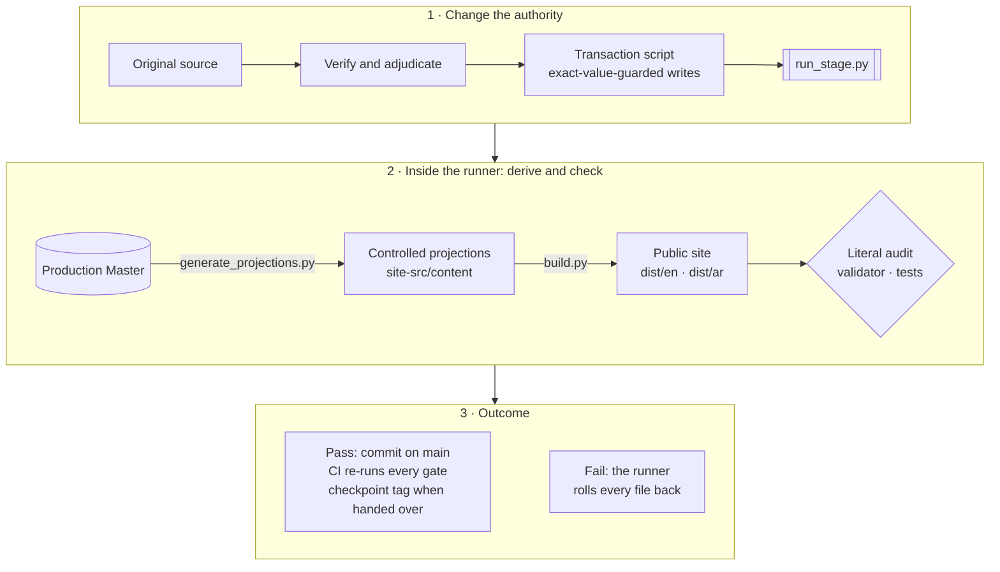

# Yemen Financial Inclusion Evidence · أدلة الشمول المالي في اليمن

[](https://github.com/CausewayGrp/Financial-inclusion-/actions/workflows/verify.yml)

A bilingual public evidence resource, built by CauseWay, that helps people **understand, compare and verify** the
evidence on financial inclusion in Yemen. Arabic and English are co-authoritative editions. It clarifies evidence for
human decisions; it does not make regulatory, political, business or funding decisions for anyone.

This is the **single production repository** and the only working copy. Its `main` branch is the current state. The
Production Master is the sole semantic, evidence, source, rights, controlled-product-state and publication-state
authority; everything else here is derived from it, implements it, or records how it came to be.

## Status at a glance

| | |
|---|---|
| **Position** | **DESIGN HANDOFF READY** (R8.6 closed; final integration programme F0–F9 closed — [clean-room acceptance](audit/FINAL_CLEAN_ROOM_ACCEPTANCE.md); post-F9 correction and design-enablement control pass of 27 September 2026 applied) |
| **Not declared** | Not PUBLIC RELEASE READY |
| **Next** | Claude Design, starting at [`handoff/README_FIRST.md`](handoff/README_FIRST.md) — gates D0–D7, ending in a runnable, fully populated bilingual reference site; the repository is its memory |
| **Design programme — current state** | **Date** 27 September 2026 · **Last accepted gate** D1 (`main` at `851f496`, pull request #3 merged) · **Working gate** D2 · **Status** the hard families are built and proved on the accepted T4 direction: every one of the 288 documents renders from the one content path; Explore, the five hard domain answers, the Evidence directory, the §9.1 record set, Compare and Data & sources are composed and each §9.2 hard state is asserted on the rendered DOM (`design/reference/check_site.py`: 168 renders, 84 smoke tests, 157 hard-state assertions, 20 degraded renders); the two repository browser suites (25/26, 168/168), bilingual invariance (0 of 143) and content parity (288 documents) pass on the reference site; the five D1 residuals are reconciled (DL-D2-002); the D3 families build by the family rule; two escalations open, two raised · **Branch / PR** `claude/epic-cori-60fpeb` → draft pull request (link in `docs/CHANGELOG.md` once opened) · **Next action** CI on the pull request, then the owner's merge decision; D3 (Readings, Measurement, Methodology, trust, the Home cold-reader test) continues from it · **Build and check** `python3 design/reference/build.py && python3 design/reference/check_content.py --text && python3 design/reference/check_site.py --gate d2 --degraded && python3 design/reference/check_trio.py && python3 design/reference/tokens.py --check`, then the suites with `YFIE_SITE_DIR=design/reference/out` · **Records** [`design/00_DESIGN_README.md`](design/00_DESIGN_README.md) (status, decision log DL-D2-*), [`design/04_PAGE_FAMILY_COMPOSITIONS.md`](design/04_PAGE_FAMILY_COMPOSITIONS.md), [`design/03_COMPONENT_CATALOG.md`](design/03_COMPONENT_CATALOG.md), [`design/09_CODE_HANDOFF.md`](design/09_CODE_HANDOFF.md) |
| **Owner actions** | Push the two checkpoint tags ([below](#checkpoints-and-tags)); the OWNER_INPUT and RELEASE_ONLY items in [`FINAL_OPEN_ITEMS_REGISTER.md`](FINAL_OPEN_ITEMS_REGISTER.md) |
| **Production Master** | `authority/Yemen_Financial_Inclusion_Evidence_Master.xlsx` · SHA-256 `17db032b15da16fc4b5b3c3b49f19aebf2ecb4ec46634613fe8505d0f038690b` |
| **Page Specs** | `site-src/content/page_specs.json` · SHA-256 `d45748046ea56fd0e67fdf112f9888de65b3fe7fab46ce6f51de3a80824b69aa` |
| **Logo authority** | `site-src/assets/CauseWay_Master_Logo.png` · SHA-256 `5830163d…` (full value: `logo_sha256` in [`FINAL_REPOSITORY_MANIFEST.json`](FINAL_REPOSITORY_MANIFEST.json)); never redrawn, recoloured, cropped or regenerated |
| **Last state OpenAI reviewed** | Commit `f726bda`, tree byte-identical to `…TRANCHE_C_COMPLETE_READING_HOLD.zip` (SHA-256 `63612dea…`); accepted 26 September 2026 |
| **Currentness cut-off** | 26 September 2026 ([`audit/FINAL_CURRENTNESS_CUTOFF.md`](audit/FINAL_CURRENTNESS_CUTOFF.md)) |
| **Re-entry document** | [`OPENAI_REENTRY_CHECKPOINT.md`](OPENAI_REENTRY_CHECKPOINT.md) |

The same state is recorded in [`authority/YFI_CURRENT_PROJECT_CONTEXT.json`](authority/YFI_CURRENT_PROJECT_CONTEXT.json),
the checkpoint and [`handoff/IMPLEMENTATION_MANIFEST.json`](handoff/IMPLEMENTATION_MANIFEST.json); the validator fails if
their hashes or their handoff state diverge.

## Start here — by role

| You are | Start with | Then |
|---|---|---|
| **Claude Design** | [`handoff/README_FIRST.md`](handoff/README_FIRST.md) — the one start file and reading order | [`handoff/CLAUDE_DESIGN_MASTER_PROMPT.md`](handoff/CLAUDE_DESIGN_MASTER_PROMPT.md), the one executable brief |
| **Claude Code** | [`handoff/CLAUDE_CODE_MASTER_PROMPT.md`](handoff/CLAUDE_CODE_MASTER_PROMPT.md) — waits for the accepted Design package | [`handoff/ENGINEERING_HANDOFF_EXPECTATIONS.md`](handoff/ENGINEERING_HANDOFF_EXPECTATIONS.md), [`docs/DEPLOYMENT.md`](docs/DEPLOYMENT.md) |
| **An independent reviewer** | [`OPENAI_REENTRY_CHECKPOINT.md`](OPENAI_REENTRY_CHECKPOINT.md) | [`audit/FINAL_CLEAN_ROOM_ACCEPTANCE.md`](audit/FINAL_CLEAN_ROOM_ACCEPTANCE.md), [`audit/INDEX.md`](audit/INDEX.md) |
| **The programme steward** | [`AGENTS.md`](AGENTS.md), then [`CONTRIBUTING.md`](CONTRIBUTING.md) | [`authority/CORE_CONSTITUTION.md`](authority/CORE_CONSTITUTION.md); §4 of the protocol for any Master change |
| **The owner (CauseWay)** | [Owner actions](#owner-actions) below | [`FINAL_OPEN_ITEMS_REGISTER.md`](FINAL_OPEN_ITEMS_REGISTER.md) §5 (owner inputs) and §2 (release-only) |

## Quick start

```bash
git clone https://github.com/CausewayGrp/Financial-inclusion-.git && cd Financial-inclusion-
python3 -m pip install -r requirements.txt           # Python 3.11
python3 -m playwright install chromium                # only for the two browser suites

python3 scripts/checksums.py --check                  # every file matches SHA256SUMS.txt
python3 scripts/validate.py                           # WEBSITE REPOSITORY VALIDATION PASS
python3 -m http.server 4173 --directory dist          # preview: http://localhost:4173/en/ and /ar/
```

All gates, with what each protects, are in [`CONTRIBUTING.md` §5](CONTRIBUTING.md#5-the-gates); CI runs them on every
push to `main` and every pull request. They also pass from an extracted archive with no `.git`.

## How truth flows



A content defect is never fixed in a page, a JSON file or code alone. It is fixed in the Master through a transaction
that the runner commits or rolls back as a whole:
**SOURCE → VERIFY → ADJUDICATE → MASTER FIRST → REGENERATE → SEMANTIC PARITY → PUBLIC ACCEPTANCE.**
The procedure is [`CONTRIBUTING.md` §4](CONTRIBUTING.md#4-changing-the-master). Two files under `site-src/content/` are
not generated: the presentation-depth and navigation contracts, which the steward maintains in place and the generator
validates ([`CONTRIBUTING.md` §2](CONTRIBUTING.md#2-who-owns-what-and-how-it-changes)).

## The public product


- **Experience:** UNDERSTAND → EXPLORE → VERIFY. A consequential claim travels as ANSWER → SCOPE → BOUNDARY → VERIFY.
- **Question first:** Home offers four common governed questions; Explore holds all of them in four clusters; eight
  domain answer routes (`/people/ /firms/ /finance/ /providers/ /payments/ /remittances/ /access/ /reforms/`) carry the
  answers, each with its scope, boundary, unknowns, next measurement and verification path.
- **Primary navigation:** Explore · Evidence · Evidence Readings · Data & sources · Method & Measurement (Methodology,
  Measurement Agenda). **Trust:** About · Corrections · Rights & reuse · Accessibility · Privacy · Terms · Contact. Derived
  from [`navigation_interaction.json`](site-src/content/content/navigation_interaction.json).
- **Verification:** every Evidence Record is a canonical page with its definition, population, period, currentness,
  boundary, method and original sources; Compare tests whether records can be compared before showing values.
- **Semantic firewall, visible in every surface:** people ≠ accounts · access ≠ use · infrastructure ≠ outcome · target ≠
  result · programme KPI ≠ national prevalence · licence/listing ≠ operation · observed ≠ estimated ≠ projected ·
  missing ≠ zero · chronology ≠ causality.
- **Not:** a generic Yemen financial-system observatory, a provider ranking, an unofficial strategy or a CauseWay
  marketing site. CauseWay organises, synthesises and maintains; source institutions remain authoritative for their data.

### Scale

Counts come from [`public_inventory.json`](site-src/content/content/public_inventory.json), which is derived from the
Master; the validator checks every figure below against it. Counts are an inventory, not a measure of evidence strength.

- 143 controlled Page Specs; 286 localized route documents + root + 404 = 288 static HTML documents.
- 110 Evidence Records, of which 60 are controlled public claims; 55 Evidence Passports (reference material, never
  rendered).
- 10 Readings; 10 Measurement priorities; 11 governed entry questions.
- 36 governed visual contracts, each with a design tier in `site-src/content/visuals/visual_design_contracts.json`.
- 160 source records, of which 151 expose a public original locator; 28 curated resource cards.
- 24 documented chronology events.
- 435 public search records.

## Decisions that shape everything here

| Decision | Why | Recorded in |
|---|---|---|
| One Production Master; everything else derived or subordinate | One place where truth changes, with a cell-level ledger and a rollback | [`authority/CORE_CONSTITUTION.md`](authority/CORE_CONSTITUTION.md) |
| Information architecture: Explore · Evidence · Evidence Readings · Data & sources · Method & Measurement, with a secondary trust layer; no route changes | Task-first labels a general reader understands, without breaking deep links | [`audit/CLAUDE_S01_IA_DECISION.md`](audit/CLAUDE_S01_IA_DECISION.md) |
| Question-led entry: a few starting questions on Home, all of them on Explore | One mental model for entry; no competing task taxonomy | [`audit/R8_4A_HOME_EXPLORE_ENTRY_JOURNEY_CLOSURE.md`](audit/R8_4A_HOME_EXPLORE_ENTRY_JOURNEY_CLOSURE.md) |
| Evidence Records are separate from original sources; a source without a public locator is never named | Readers verify against the original; nothing unverifiable is presented as citable | [`audit/R8_1_PUBLIC_TRUTH_SOURCE_REFERENCE_CLOSURE.md`](audit/R8_1_PUBLIC_TRUTH_SOURCE_REFERENCE_CLOSURE.md) |
| No composite score, dashboard or synchronised "current state" | The evidence shares no clock, unit, denominator or population | Design brief §4.4 |
| Arabic and English co-authoritative; every page pair prints the same numbers | Neither edition is a translation of the other; a gate enforces numeric parity | [`audit/F5_PUBLIC_CORPUS_ACCEPTANCE.md`](audit/F5_PUBLIC_CORPUS_ACCEPTANCE.md) |
| Static, local-first, strict-CSP compatible; no analytics, cookies or accounts | Works without a backend; nothing to leak or track | [`docs/DEPLOYMENT.md`](docs/DEPLOYMENT.md) |
| Two controlled contracts maintained by the steward, validated by the generator | Presentation depth and navigation are product decisions, not facts | [`CONTRIBUTING.md` §2](CONTRIBUTING.md#2-who-owns-what-and-how-it-changes) |
| Design completes only with a runnable, fully populated bilingual reference site, after competing theses are tested | Code must never guess; a picture is not a specification | Design brief §19–§20 |
| Design works in a loop and remembers through the repository: kernel, decision log, coverage ledger, design-debt register, escalations, Code handoff — re-read at every gate start, committed at every gate end | A cold agent, or Code later, continues without any conversation | Design brief §0, §19 |
| IBM Plex Sans and Sans Arabic, vendored unchanged; the canonical logo never altered | Identity and licence integrity | [`vendor/fonts/README.md`](vendor/fonts/README.md), Design brief §8 |

## The Design handoff in brief

Claude Design reads [`handoff/README_FIRST.md`](handoff/README_FIRST.md) and the brief, then works in eight gates, one pull
request each:

- **D0** — dependency map from [`handoff/ROUTE_CONTENT_AND_STATE_INVENTORY.json`](handoff/ROUTE_CONTENT_AND_STATE_INVENTORY.json);
  a statement on whether any approved visual board or mockup was supplied (only what is in the repository binds); the
  records opened — decision log, coverage ledger `design/COVERAGE.csv`, design-debt register, escalations, Code handoff.
  No polished screens yet.
- **D1** — two or three materially different design theses tested on Home, the dense Evidence Record
  `/evidence/CLM-003/` and the flagship Reading `/readings/same-year-different-number/`, in English and Arabic, with real
  content; one chosen with recorded reasons; then the grammar. Nothing propagates before this gate closes.
- **D2–D6** — hardest families, synthesis pages, complete binding, interaction and accessibility, visuals, social images,
  print and portable evidence.
- **D7** — acceptance against [`handoff/DESIGN_ACCEPTANCE_CRITERIA.md`](handoff/DESIGN_ACCEPTANCE_CRITERIA.md) on the
  runnable, fully populated bilingual reference site: every label governed (no placeholder ships), the four review tests
  and the last-10-percent audit done, the records complete, `design/09_CODE_HANDOFF.md` final
  ([`handoff/DESIGN_TO_CODE_CONTRACT.md`](handoff/DESIGN_TO_CODE_CONTRACT.md)).

Every gate has an entry condition, durable outputs, exit evidence and stop conditions (brief §20), and closes with the
Code recipient test: could Claude Code continue from this commit without the Design conversation?

Design never edits the Master, the projections, the contracts or the public build: it escalates
(`ESCALATE_TO_MASTER`, `NEEDS_CONTROLLED_CONTENT`) and the steward answers Master-first.

## Programme tracker

| Stage | Scope | State | Record |
|---|---|---|---|
| R0–R8.3 | Reconciliation, public voice, Readings and Measurement, method and trust, journeys, resources, information design, bilingual invariance, source-reference closure, literature recovery, intellectual product | CLOSED / PASS | [`audit/R0_…`](audit/R0_CANONICAL_RECONCILIATION_CLOSURE.md) … [`audit/R8_3_…`](audit/R8_3_INTELLECTUAL_PRODUCT_CLOSURE.md) |
| R8.4A | Home, Explore and governed question-led entry | CLOSED / PASS | [`audit/R8_4A_…`](audit/R8_4A_HOME_EXPLORE_ENTRY_JOURNEY_CLOSURE.md) |
| Tranche A | Authority and active surface; IA decision (Option B, no route changes); currentness; resource model; domain architectures | CLOSED | [`audit/CLAUDE_TRANCHE_A_HANDBACK.md`](audit/CLAUDE_TRANCHE_A_HANDBACK.md) |
| Tranche B | Master-first patch specification, then execution in five transactional stages | CLOSED | [`audit/TRANCHE_B_EXECUTION_CLOSURE.md`](audit/TRANCHE_B_EXECUTION_CLOSURE.md) |
| P1–P5 | Pre-Tranche-C maturation (truth, tools, visual readiness, handoff alignment) and corrections | CLOSED; independently accepted | [`audit/P5_…`](audit/P5_INDEPENDENT_ACCEPTANCE_CORRECTIONS.md) |
| **R8.4 · Tranche C** | Whole-product adversarial acceptance: nine-lens panel, 229 findings dispositioned, 9 BLOCKERs closed, transactions TC-S1, TC-A … TC-I | **COMPLETE**; accepted by OpenAI (26 Sep 2026); Reading prose completed in F2 | [`audit/TRANCHE_C_FINAL_ACCEPTANCE.md`](audit/TRANCHE_C_FINAL_ACCEPTANCE.md) |
| F1–F2 | Evidence Readings portfolio adjudicated and integrated Master-first (RP-F2); bilingual invariance 0 | CLOSED | [`audit/READING_PORTFOLIO_FINAL_ADJUDICATION.md`](audit/READING_PORTFOLIO_FINAL_ADJUDICATION.md) |
| F3 | Five bounded Resource Library decisions | CLOSED | [`audit/F3_RESOURCE_DECISIONS.md`](audit/F3_RESOURCE_DECISIONS.md) |
| F4 · R8.5 | Repository subtraction: copy out of code, one path from authority to recipient, file manifest, audit index, permanent gates | CLOSED | [`audit/R8_5_REPOSITORY_SUBTRACTION_CLOSURE.md`](audit/R8_5_REPOSITORY_SUBTRACTION_CLOSURE.md) |
| F5 | Whole public corpus acceptance: every public text reviewed in Arabic, English and parity; 667 findings decided | CLOSED | [`audit/F5_PUBLIC_CORPUS_ACCEPTANCE.md`](audit/F5_PUBLIC_CORPUS_ACCEPTANCE.md) |
| F6 | Discovery (canonical, hreflang, robots, sitemap, structured data), accessibility contract, rights, security and privacy gates | CLOSED | [`audit/F6_…`](audit/F6_DISCOVERY_ACCESSIBILITY_RIGHTS_SECURITY_ACCEPTANCE.md) |
| F7 | Sustainability baseline of the reference build (bytes, requests, cold and warm) and a non-public stewardship note | CLOSED | [`docs/SUSTAINABILITY_METHOD.md`](docs/SUSTAINABILITY_METHOD.md) |
| F8 · R8.6 | Handoff freeze: one start file, one Design prompt, one logo authority, route/content/state inventory, acceptance criteria, Design→Code contract, open-items register | CLOSED | [`audit/R8_6_…`](audit/R8_6_DESIGN_HANDOFF_FREEZE_CLOSURE.md) |
| **F9 · R8.6** | Clean-room acceptance by three cold recipients; archive test from an empty directory; final register; fonts vendored; RF9 | **CLOSED — DESIGN HANDOFF READY** | [`audit/FINAL_CLEAN_ROOM_ACCEPTANCE.md`](audit/FINAL_CLEAN_ROOM_ACCEPTANCE.md) |
| Post-F9 correction | OWN-07 and OWN-08 closed (the `/remittances/` Measurement card; stale navigation-contract fields); controlled contracts classified; handoff tightened in place (D1 theses, decision log and coverage ledger, runnable site as the D7 requirement, no placeholders, print and portable evidence, fonts, supplied-board rule) | CLOSED (27 Sep 2026) | [`audit/FINAL_CLEAN_ROOM_ACCEPTANCE.md`](audit/FINAL_CLEAN_ROOM_ACCEPTANCE.md) addendum; directive [`audit/directives/D8_POST_F9_CORRECTION_2026-09-27.txt`](audit/directives/D8_POST_F9_CORRECTION_2026-09-27.txt); [`docs/CHANGELOG.md`](docs/CHANGELOG.md) |
| Design-enablement control pass | Handoff checked against the quality doctrine for a cold Design recipient and strengthened in place: kernel, working loop, gate-start memory rule, Code recipient test; audience lenses and family outcomes; review tests; imagery, motion, dark mode, exports, rights, inputs; decision fields, coverage status ladder, design-debt register; gate entry/exit/stop; last-10-percent audit | CLOSED (27 Sep 2026) | Second addendum in [`audit/FINAL_CLEAN_ROOM_ACCEPTANCE.md`](audit/FINAL_CLEAN_ROOM_ACCEPTANCE.md); directive [`audit/directives/D9_DESIGN_ENABLEMENT_CONTROL_PASS_2026-09-27.txt`](audit/directives/D9_DESIGN_ENABLEMENT_CONTROL_PASS_2026-09-27.txt) |

## Open items

Every item, classed and owned, is in [`FINAL_OPEN_ITEMS_REGISTER.md`](FINAL_OPEN_ITEMS_REGISTER.md): 47 items,
**zero DESIGN_BLOCKER**.

- **Engineering after Design (11):** the production runtime, the WCAG 2.2 audit of the implemented site, web-size logo
  derivatives (owner-approved; the master file is never changed), no CSS recolouring of the logo, the Method & Measurement
  navigation group, Compare entry from a record and mobile Compare, a source-type filter on the governed field,
  self-hosted IBM Plex, social images, re-measured page weight, Home and Explore question sets out of code.
- **Release only (4):** security headers at the host, source reuse rights, optional native Arabic certification, named
  release acceptance.
- **External evidence dependencies (11):** sources not yet read in the original — among them IMF Country Report 26/80
  (four chronology facts), the date of Decision No. 10 of 2026, the entity names in Decision No. 18 of 2026, the OECD
  2026 figures and the SFD/SMED primary. The public text stays unchanged until each is read.
- **Known evidence frontiers (8), stated on the pages and never filled:** the withheld CLM-044 value, the ~147-firm base
  behind the 91.84% table, the CBY-Aden ↔ IMF remittance crosswalk, the causes of the gender gap, reconciled current
  operating-provider status, the size of the 2022 banking restatement, composite records without listed members, one
  deferred sub-national series.
- **Owner input (6):** CauseWay identity and funding statement, contact-mailbox confirmation, the public origin, a content
  licence (gates every CauseWay-content download and export), stewardship decisions, a reversed logo if Design needs one.
- **Rejected / no action (7):** recorded so nobody reopens them by accident.

## Owner actions

1. **Push the two checkpoint tags** — the session that prepared this state could not push tags (its git access returns
   HTTP 403 for tag pushes). The exact commands are in [`OPENAI_REENTRY_CHECKPOINT.md` §7](OPENAI_REENTRY_CHECKPOINT.md#7-owner-actions).
2. **Decide the owner inputs** in the register: the CauseWay identity and funding statement, the contact mailbox, the
   public origin, the content licence, stewardship, and a reversed logo only if Design asks for one.
3. **Before any public release:** the RELEASE_ONLY items, a post-implementation accessibility audit and a named release
   acceptance. Nothing in this repository declares public release readiness.

## Checkpoints and tags

A checkpoint is a governed state handed to a reviewer or to Design: a signed, annotated tag `checkpoint/<state>` on a
green `main` commit; `.github/workflows/checkpoint.yml` then rebuilds the archive, verifies it from an empty extraction
and attaches it to a pre-release ([`CONTRIBUTING.md` §6](CONTRIBUTING.md#6-checkpoints-and-packages)).

| Tag | Commit | State on GitHub |
|---|---|---|
| `checkpoint/tranche-c-complete-reading-hold` | `f726bda` — the tree OpenAI reviewed | Not yet pushed (owner action) |
| `checkpoint/design-handoff-ready` | The design-enablement control-pass commit on `main` — the state Claude Design starts from (named in [`docs/CHANGELOG.md`](docs/CHANGELOG.md)) | Not yet pushed (owner action) |

A checkpoint tag is never moved or rewritten. Until the tags exist, commits and the changelog identify each state.

## Where to find everything

| Question | Where |
|---|---|
| What is current? | This file, [`OPENAI_REENTRY_CHECKPOINT.md`](OPENAI_REENTRY_CHECKPOINT.md), [`authority/YFI_CURRENT_PROJECT_CONTEXT.json`](authority/YFI_CURRENT_PROJECT_CONTEXT.json) |
| What is still open, and who owns it? | [`FINAL_OPEN_ITEMS_REGISTER.md`](FINAL_OPEN_ITEMS_REGISTER.md) |
| Where does Claude Design start? | [`handoff/README_FIRST.md`](handoff/README_FIRST.md) — one file, one reading order |
| What is every file? | [`FINAL_REPOSITORY_MANIFEST.json`](FINAL_REPOSITORY_MANIFEST.json) (class of every tracked file); [`SHA256SUMS.txt`](SHA256SUMS.txt) (its hash) |
| What changed, when and why? | `git log`; [`docs/CHANGELOG.md`](docs/CHANGELOG.md) |
| Which cells of the Master changed? | Per transaction: `audit/<stage>/runs/<TX>_MASTER_LEDGER.json` (cell level) and `<TX>_RUN_REPORT.json` (gates); also the commit trailers |
| Every finding and its disposition | [`audit/F5_CORPUS_FINDINGS_LEDGER.csv`](audit/F5_CORPUS_FINDINGS_LEDGER.csv) (public corpus); [`audit/TRANCHE_C_FINDINGS_LEDGER.csv`](audit/TRANCHE_C_FINDINGS_LEDGER.csv); earlier [`audit/pre_tranche_c/FINDINGS_LEDGER.csv`](audit/pre_tranche_c/FINDINGS_LEDGER.csv); the three F9 cold-recipient reports in `audit/final_integration/inputs/` |
| Which audit record answers what? | [`audit/INDEX.md`](audit/INDEX.md) |
| The binding programme | [`audit/directives/`](audit/directives/README.md) — D7 (F0–F9), D8 (post-F9 correction) and D9 (design-enablement control pass) are complete |
| Is a commit sound? | Actions → **Verify** (`Governance gates`, `Browser acceptance`) |

```bash
git log --oneline --decorate                                      # history
git log --grep='^Master-After:' --date=short \
  --format='%h %ad %(trailers:key=Transaction,valueonly,separator=) %(trailers:key=Master-Before,valueonly,separator=) → %(trailers:key=Master-After,valueonly,separator=)'
git diff --stat f726bda -- authority site-src dist                # governed change since the reviewed state
git tag -l 'checkpoint/*' -n1                                     # checkpoints, once the owner has pushed them
```

## Repository map

| Path | Role | Edited by |
|---|---|---|
| [`authority/`](authority/) | The Production Master, the constitution, the current-state pointers | Transactions and the runner only (constitution: explicit decision) |
| [`site-src/content/`](site-src/content/) | Controlled projections: Page Specs, sections, evidence, sources, visuals, search | Generator only |
| `site-src/content/presentation_priority.json`, `site-src/content/content/navigation_interaction.json` | Controlled contracts: presentation depth; navigation and interaction | The steward, in place, naming the finding; validated by the generator |
| `site-src/app.js`, `site-src/styles.css`, `site-src/assets/` | Static runtime baseline and the canonical CauseWay logo (never redrawn) | Directly, with the gates |
| [`scripts/`](scripts/) | Generator, build, literal audit, validator, rebind, inventory, checksums, tests | Directly, with the gates |
| `dist/` | The generated public site, committed so every public change is reviewable | `scripts/build.py` only |
| [`design/architecture/`](design/architecture/) | Diagrams derived from the navigation contract and inventory | `scripts/architecture_diagrams.py` |
| `design/` (everything else) | Claude Design's package and reference site, once D0 begins | Claude Design, through pull requests |
| [`vendor/fonts/`](vendor/fonts/README.md) | IBM Plex Sans and IBM Plex Sans Arabic (woff2, OFL), unchanged, for Design and Code; not loaded by the reference build | Replaced only by a newer unchanged release |
| [`handoff/`](handoff/) | Design → Code recipient package (DESIGN HANDOFF READY); start at [`handoff/README_FIRST.md`](handoff/README_FIRST.md) | The programme only |
| [`audit/`](audit/) | Closures, ledgers, transaction scripts and run reports, directives | Append only; history is not rewritten |
| [`docs/`](docs/) | Changelog, deployment, sustainability method, repository protocol; S00–S06 records are lineage | Directly |
| [`.github/`](.github/) | CI (`verify.yml`), checkpoint packaging (`checkpoint.yml`), Dependabot, PR template | Directly |
| `FINAL_OPEN_ITEMS_REGISTER.md` | Every open item, classed and owned | The steward; closures appended |
| `FINAL_REPOSITORY_MANIFEST.json`, `SHA256SUMS.txt` | Class and hash of every tracked file | `scripts/repository_manifest.py`, `scripts/checksums.py` |

## Working on this repository

- **Protocol:** [`CONTRIBUTING.md`](CONTRIBUTING.md) — ownership, branches, commit trailers, Master transactions, gates,
  checkpoints, session sync, known pitfalls, recommended repository settings.
- **AI agents** (Claude Code, Claude Design, review agents): [`AGENTS.md`](AGENTS.md); `CLAUDE.md` imports it.
- **Durable rules:** [`authority/CORE_CONSTITUTION.md`](authority/CORE_CONSTITUTION.md).
- Every session starts from `origin/main` and ends with a push. Work that exists only in a chat, a ZIP or a Drive folder
  does not exist for the next session.

## Release boundary

Controlled content and green gates are not enough to call the product ready for live release. Release also requires
technical, runtime, security and privacy acceptance; deployed mobile, RTL and accessibility acceptance; publication
filtering; rights and legal checks where applicable; correction and version behaviour; and named release approval.
Not claimed anywhere in this repository: native Arabic certification, legal review, WCAG conformance, rights clearance,
security guarantees or service levels.

## Historical lineage

- The R0–R8 finalization records, the Tranche A/B closures and the S00–S06 documents under `docs/` are kept as lineage
  and are not rewritten. `audit/R8_CONTINUATION_MASTER_HANDOVER_TO_NEXT_WINDOW.md` and `audit/FINALIZATION_PROGRAM.md`
  describe the programme as it stood when they were written.
- Before 26 September 2026 the working repository was a Drive folder, exchanged as ZIP checkpoints. Those copies were
  deliberately left untouched and are lineage, not working copies (`EXTERNAL_REPOSITORY_SYNC_PENDING` records that
  state; no sync is owed). The Master entry state recorded with the Drive IDs was `e6980410…` (full value in
  `authority/AUTHORITY.json`).
